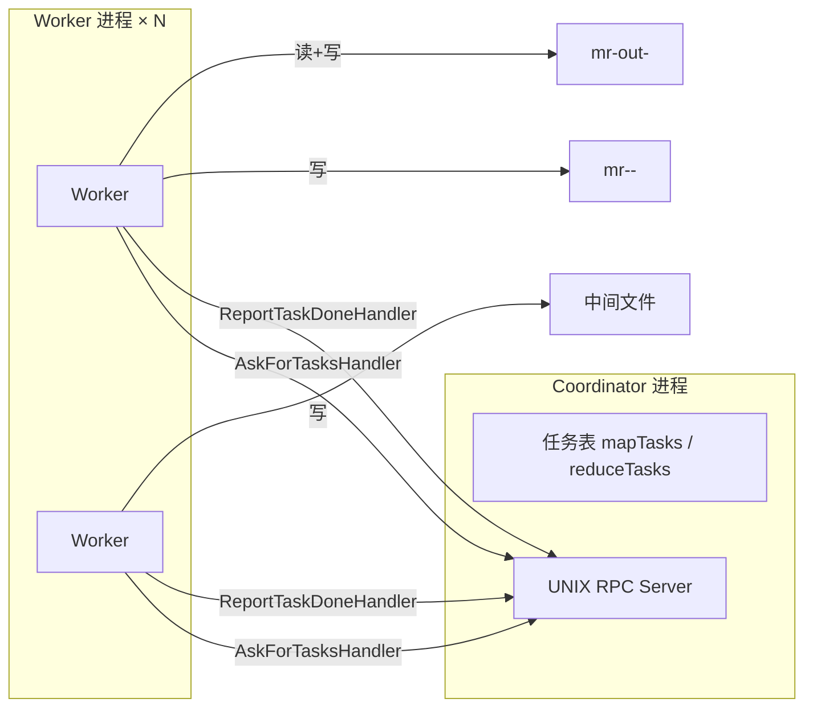
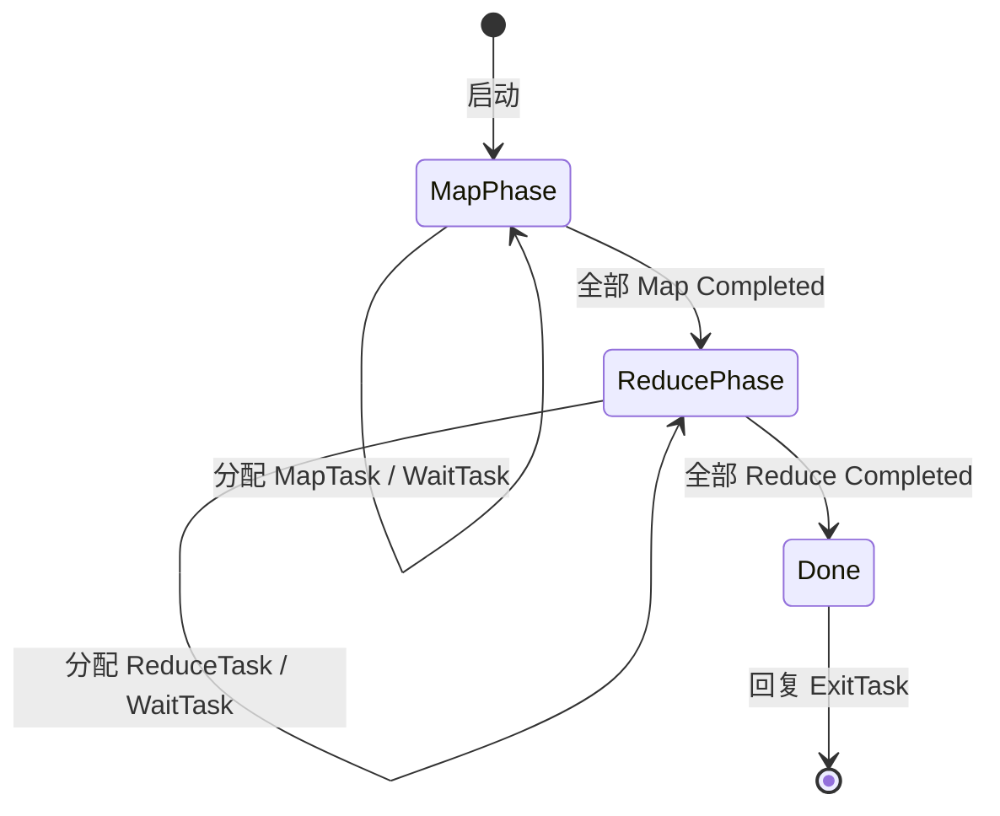
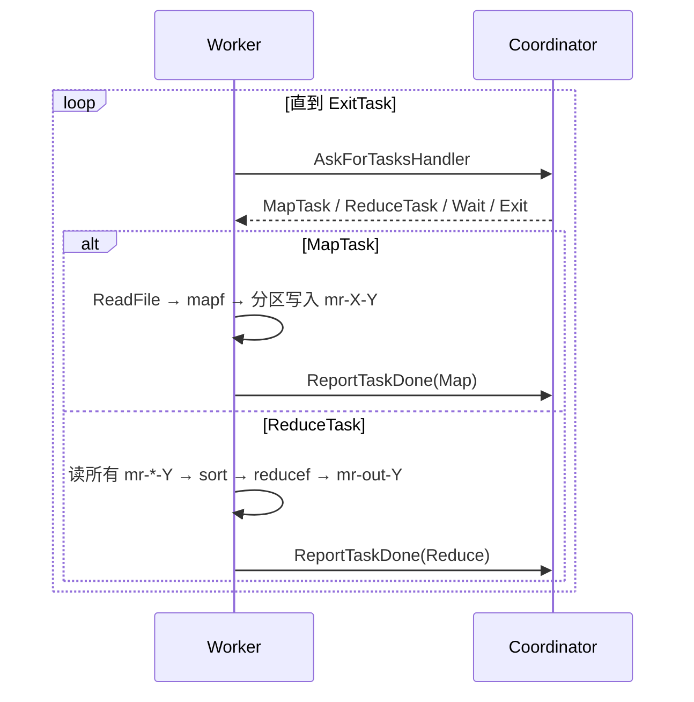
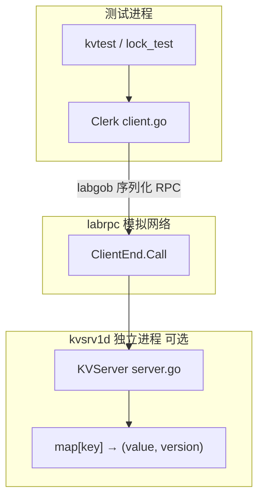
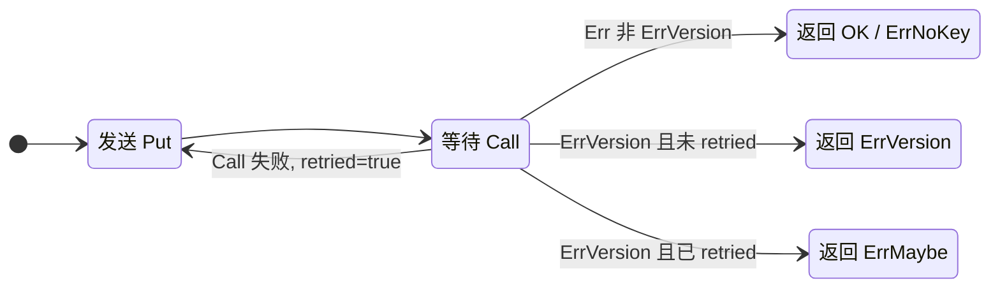
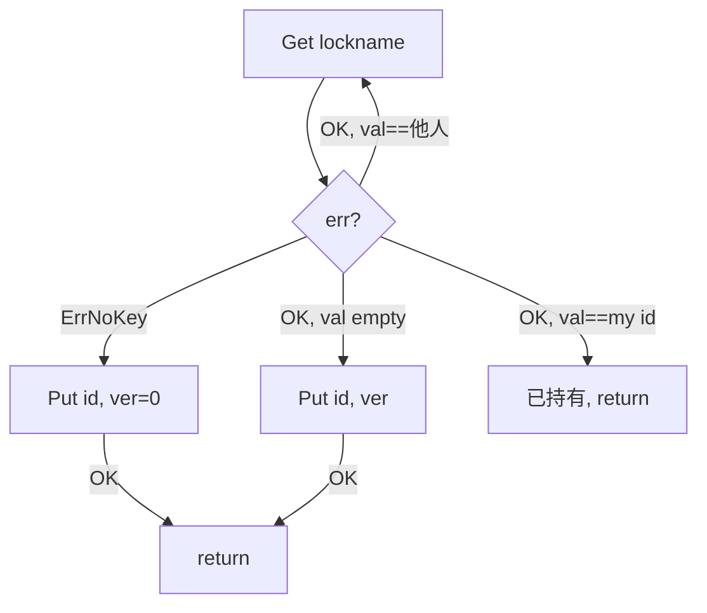

# 6.5840 / MIT 分布式系统实验笔记

本仓库为 [MIT 6.5840 (Spring 2026)](https://pdos.csail.mit.edu/6.5840/) 课程实验的本地实现与复习文档。  
当前已完成 **Lab 1（MapReduce）** 与 **Lab 2（单机 KV Server + Lock）** 的主体实现；后续 Lab（Raft、KV Raft、Shard KV 等）目录已存在，尚未在本文档中展开。

---

## 目录

1. [仓库结构](#仓库结构)
2. [开发历史（Git）](#开发历史git)
3. [如何编译与测试](#如何编译与测试)
4. [Lab 1：MapReduce](#lab-1mapreduce)
5. [Lab 2：单机 KV Server](#lab-2单机-kv-server)
6. [概念对照表](#概念对照表)
7. [常见坑与调试](#常见坑与调试)
8. [后续 Lab 预告](#后续-lab-预告)

---

## 仓库结构

```
6.5840-mr/
├── Makefile              # 课程提交用（lab1/lab2 tar 等）
├── README.md             # 本文档
└── src/
    ├── go.mod            # module 6.5840
    ├── Makefile          # 日常测试：make mr / make kvsrv1 / make lock1
    ├── mr/               # ★ Lab 1：Coordinator + Worker
    ├── mrapps/           # MapReduce 插件（wc、indexer 等，课程提供）
    ├── main/             # 各 lab 的 main / daemon 入口
    ├── kvsrv1/           # ★ Lab 2：KV server、client、lock
    │   ├── server.go
    │   ├── client.go
    │   ├── rpc/
    │   └── lock/
    ├── kvtest1/          # KV 测试框架（Porcupine 线性化检查等）
    ├── labrpc/           # 模拟不可靠网络的 RPC（channel + labgob）
    ├── tester1/          # 测试 harness（多进程 daemon、UNIX socket）
    ├── kvraft1/          # Lab 3+（未实现）
    ├── raft1/
    └── shardkv1/
```

**两个 RPC 世界的区别（复习时容易混）：**

| 维度 | Lab 1 `mr` | Lab 2 `kvsrv1` |
|------|------------|----------------|
| RPC 实现 | Go 标准库 `net/rpc` + **UNIX domain socket** | 课程 `labrpc`（内存 channel 模拟网络）+ 可选 **独立进程** `kvsrv1d` |
| 传输语义 | 课堂假设相对可靠；Worker 崩溃靠 **任务超时重派** | 可配置 **丢包 / 延迟 / 乱序** |
| 状态位置 | Coordinator 进程 + Worker 本地磁盘中间文件 | KV Server 进程内 `map[string](value, version)` |

---

## 开发历史（Git）

| 提交（摘要） | 内容 |
|--------------|------|
| `29fbf9b` | MapReduce 基础框架 |
| `7053ef9` | MapReduce 完整实现并通过测试 |
| `cd28f30` | Lab 2：单机线性化 KV server（`server.go`） |
| `74535f5` | Lab 2：基于 KV 的 CAS 分布式锁（`lock/lock.go`） |
| `aa2f140` | Lab 2：不可靠网络下的 Clerk 重试与 `ErrMaybe`（`client.go`） |

---

## 如何编译与测试

所有日常命令在 **`src/`** 目录下执行：

```bash
cd src

# Lab 1：MapReduce（可加 RUN 过滤子测试）
make mr
make RUN="-run TestWc" mr

# Lab 2：KV server（可靠 + 不可靠）
make kvsrv1
make RUN="-run Reliable" kvsrv1
make RUN="-run Unreliable" kvsrv1

# Lab 2：基于 KV 的锁
make lock1
make RUN="-run Unreliable" lock1
```

**注意：** `make lock1` 必须在 `src/` 下运行；在 `src/kvsrv1` 内直接 `make lock1` 会找不到 Makefile 目标。

提交打包（课程根目录）：

```bash
cd ..   # 仓库根目录
make lab1   # 或 lab2
```

---

## Lab 1：MapReduce

### 1.1 目标

实现论文 [*MapReduce: Simplified Data Processing on Large Clusters*](https://research.google/pubs/mapreduce-simplified-data-processing-on-large-clusters/) 中的 **Coordinator（Master）** 与 **Worker**，支持：

- 多 Worker 并行 Map / Reduce
- Worker 崩溃或卡死时 **重新调度** 任务
- Map 输出按 key 分区到 `nReduce` 个中间文件

### 1.2 整体架构



**进程与地址空间：**

- `main/mrcoordinator.go`：创建 `Coordinator`，循环 `Done()` 直到 Map+Reduce 全部完成。
- `main/mrworker.go`：加载 `mrapps/*.so` 插件，执行 `mapf` / `reducef`，通过 **UNIX socket** 与 Coordinator RPC。
- 中间结果在 **Worker 本地文件系统**（当前目录），不是共享内存；这是真实 MapReduce「本地磁盘 + 网络 shuffle」的简化版。

**系统调用视角：** Worker `os.ReadFile` / `os.CreateTemp` / `os.Rename` 对应内核 VFS 层文件描述符；Coordinator 的 `net.Listen("unix", sockname)` 在文件系统上创建 socket 路径，数据在内核 unix sk_buff 间传递，不经过 TCP/IP 栈。

### 1.3 RPC 接口（`src/mr/rpc.go`）

| RPC | 方向 | 作用 |
|-----|------|------|
| `Coordinator.AskForTasksHandler` | Worker → Coordinator | 领取 Map / Reduce / Wait / Exit 任务 |
| `Coordinator.ReportTaskDoneHandler` | Worker → Coordinator | 上报任务完成 |

**任务类型（`AskTaskReply.TaskType`）：**

| 常量 | 含义 |
|------|------|
| `MapTask` | 处理 `FileName` 对应输入文件 |
| `ReduceTask` | 处理分区 `TaskID`（0 … nReduce-1） |
| `WaitTask` | 暂无可用任务（Map 全在进行中），Worker `Sleep` |
| `ExitTask` | 全部完成，Worker 退出 |

**任务状态（Coordinator 内 `TaskMeta`）：**

```
Idle → InProgress → Completed
         ↑_______|
    超时 10s 可重回调度
```

### 1.4 Coordinator 调度逻辑（`coordinator.go`）

核心状态机：



要点：

1. **先 Map 后 Reduce**：`isMapDone == false` 时只分配 Map；全部 Map 完成后才分配 Reduce。
2. **互斥**：`sync.Mutex` 保护任务表与计数器，避免 RPC 并发破坏状态。
3. **Straggler / 崩溃恢复**：`InProgress` 超过 **10 秒** 视为失败，任务可再次被分配（**at-least-once** 执行 Map/Reduce）。
4. **幂等完成**：`ReportTaskDoneHandler` 若任务已是 `Completed`，直接返回，避免重复计数。

### 1.5 Worker 执行流程（`worker.go`）



**Map 阶段：**

1. 读入整个输入文件（内存中）。
2. `mapf` 产生 `[]KeyValue`。
3. 对每个 KV：`bucket = ihash(key) % NReduce`（FNV-1a 哈希，保证相同 key 进同一 Reduce 分区）。
4. 每个 bucket 一个 JSON 编码的临时文件，`Rename` 为 `mr-<MapTaskID>-<bucket>`。

**Reduce 阶段：**

1. 打开所有 `mr-<i>-<ReduceTaskID>`（`i` 从 0 到 NMap-1）。
2. JSON 解码合并到 `intermediate`，按 key **排序**。
3. 对相同 key 的 value 分组，调用 `reducef`。
4. 输出 `mr-out-<ReduceTaskID>`（格式：`key value\n`）。

**与论文对应：**

| 论文概念 | 本实现 |
|----------|--------|
| Master 调度 | `Coordinator` + 两个 RPC |
| Map 输出分区 | `ihash(key) % nReduce` + 文件 `mr-i-j` |
| Reduce 输入 | 读齐所有 Map 的第 j 号分区 |
| 容错 | 10s 超时重派 + 完成上报去重 |

### 1.6 关键源文件

| 文件 | 职责 |
|------|------|
| `mr/coordinator.go` | 任务表、调度、RPC handler、`MakeCoordinator` |
| `mr/worker.go` | `Worker` 主循环、`doMapTask`、`doReduceTask` |
| `mr/rpc.go` | RPC 与任务类型常量 |
| `main/mrcoordinator.go` | 启动 Coordinator（**勿改**） |
| `main/mrworker.go` | 启动 Worker（**勿改**） |

---

## Lab 2：单机 KV Server

### 2.1 目标

在 **单台机器、单副本** 上实现 **线性化（linearizable）** 的 KV 服务：

- `Get(key)` → `(value, version, err)`
- `Put(key, value, version)` → **条件写**：仅当 `version` 与 server 当前一致时成功，并递增 version
- Clerk 在 **不可靠网络** 下重试 RPC，并向上层暴露 `ErrMaybe`
- 用 KV + CAS 实现 **分布式锁**（`Acquire` / `Release`）

后续 Lab 会把类似 server **复制到多台机器**（Raft），因此本 Lab 的 version 语义会延续。

### 2.2 分层架构



**与 Lab 1 的对比：**

- **状态**：KV 状态在 **Server 堆**上的 Go map；MapReduce 中间状态在 **Worker 磁盘文件**。
- **一致性**：KV 靠 **mutex + 单 server** 保证线性化；MapReduce 靠 **不可变中间文件 + 任务只完成一次计数** 保证正确性（允许 at-least-once 执行，Reduce 需函数满足结合律/去重）。

**进程模型（`tester1` + `main/kvsrv1d.go`）：**

- 测试与 `kvsrv1d` 是 **不同进程**，通过 UNIX socket / forward 注入 `labrpc`。
- RPC 参数经 **labgob** 编解码 → 等价于跨地址空间拷贝，不能传递 Go 指针。

### 2.3 Server 语义（`kvsrv1/server.go`）

每个 key 存 `Tuple{ value, version }`，所有 handler 在 **`mu` 互斥锁** 下执行。

| 操作 | 条件 | 结果 |
|------|------|------|
| `Get(k)` | key 不存在 | `ErrNoKey` |
| `Get(k)` | 存在 | `OK`, value, version |
| `Put(k,v,0)` | key 不存在 | 创建，**version = 1**，`OK` |
| `Put(k,v,0)` | key 已存在 | `ErrVersion`（不能用 0 覆盖已有 key） |
| `Put(k,v,ver)` | key 存在且 `ver == serverVer` | 更新 value，`version++`，`OK` |
| `Put(k,v,ver)` | key 存在且 `ver != serverVer` | `ErrVersion`（未修改） |
| `Put(k,v,ver>0)` | key 不存在 | `ErrNoKey` |

**version 的作用（系统观）：**

- 等价于每条记录上的 **乐观并发控制（OCC）/ 序列号**。
- Client 用「读到的 version」作为下一次 Put 的 **期望版本** → 只有没人插队时 CAS 成功。
- 重复 Put（相同 version）在 server 上 **不会写两次**（第二次 `ErrVersion`）→ 为 **at-most-once 写入** 打基础。

**实现时注意：** `tuple, ok := cache[key]` 得到的是 **结构体拷贝**；更新必须 **写回 map**：

```go
kv.cache[key] = Tuple{value: args.Value, version: tuple.version + 1}
```

### 2.4 Clerk：不可靠网络（`kvsrv1/client.go`）

两层错误：

| 层 | 信号 | 处理 |
|----|------|------|
| 传输层 | `Call() == false` | 请求或回复丢失 → **重发同一 RPC** |
| 应用层 | `reply.Err` | server 已处理，按语义返回 |

**Get：** 幂等，可无限重试直到 `Call == true`。

**Put：** 重传时 **必须带相同 version**（server 用 CAS 防止双写）。



**`ErrMaybe` 含义：** 重传后收到 `ErrVersion`，无法区分：

- （A）第一次 Put 已成功，回复丢失，重传被拒绝；或  
- （B）两次都未执行，别人改动了 version。

上层（如 lock）需 **`Get` 再确认** 或接受测试中的 `OK || ErrMaybe`。

### 2.5 分布式锁（`kvsrv1/lock/lock.go`）

**思路：** 锁名 = KV **key**；value = 持有者 id 或 `""`（空闲）；用 **Get + conditional Put** 实现 CAS 锁。

| 字段 | 含义 |
|------|------|
| `lockname` | KV key（每把锁独立） |
| `id` | `MakeLock` 时 `kvtest.RandValue(8)` 生成，**进程内固定**，表示本 client |

**Acquire 循环：**



**Release：** `Get` 确认 `val == my id` → `Put("", ver)` 释放。

在 Clerk 已实现重试的前提下，即使 `Put` 只判断 `== OK`，下一轮 `Get` 也常能消化 `ErrMaybe`；显式处理 `ErrMaybe` 更清晰，与 `lock_test.go` 中对 `"l0"` 的写法一致。

### 2.6 测试与验证

| 命令 | 覆盖 |
|------|------|
| `make RUN="-run Reliable" kvsrv1` | 单 client Put/Get、并发 Put、内存 |
| `make RUN="-run Unreliable" kvsrv1` | `TestUnreliableNet`（ErrMaybe） |
| `make lock1` | 锁可靠 + 不可靠、多 client |

线性化由 **Porcupine** 模型检查（`kvtest1`），在并发 Get/Put 场景验证历史可串行化为某一顺序执行。

### 2.7 Lab 2 关键源文件

| 文件 | 职责 |
|------|------|
| `kvsrv1/server.go` | `KVServer`、map、mutex、`Get`/`Put` |
| `kvsrv1/client.go` | `Clerk`、RPC 重试、`ErrMaybe` |
| `kvsrv1/rpc/rpc.go` | 错误码与 Args/Reply 类型 |
| `kvsrv1/lock/lock.go` | `Acquire` / `Release` |
| `kvsrv1/test.go` | 接入 `tester1` |
| `labrpc/labrpc.go` | 模拟网络 |
| `main/kvsrv1d.go` | KV daemon 入口 |

---

## 概念对照表

| 概念 | MapReduce (Lab 1) | KV (Lab 2) |
|------|-------------------|------------|
| 协调者 | Coordinator | 无（单 server） |
| 任务单元 | Map/Reduce Task | RPC：Get/Put |
| 分区 | `ihash(key) % nReduce` | 每 key 一条记录 |
| 容错 | 超时重派任务 | RPC 重试 + version CAS |
| 执行语义 | at-least-once（需幂等 Reduce） | Put at-most-once；不确定时 `ErrMaybe` |
| 互斥 | 任务状态机（每 task 最终 Completed 一次） | `sync.Mutex` + 条件 Put |
| 锁 | — | KV 上 CAS 锁 |

---

## 常见坑与调试

### MapReduce

1. **Reduce 过早开始**：必须等 **所有** Map `Completed` 再进入 Reduce 阶段。
2. **中间文件名**：Map 输出 `mr-<mapId>-<reduceBucket>`；Reduce 读 `mr-<i>-<reduceId>`。
3. **重复 Report**：Worker 重试可能导致多次 `ReportTaskDone`，Coordinator 需忽略已完成任务。
4. **插件路径**：在 `src/` 下 `make mr` 构建 `mrapps/*.so`。

### KV Server

1. **新建 key 后 version 应为 1**，不是 0。
2. **map 值类型拷贝**：修改 `tuple` 局部变量不会更新 map。
3. **`Get` 也要加锁**，否则 `-race` 报错且破坏线性化。
4. **Clerk `Get` 在不可靠网下必须循环 `Call`**，不能只调一次。

### Lock

1. **`lk.id` 在 `MakeLock` 生成一次**，不要每次 `Put` 再 `RandValue`。
2. **`Get` 第一个返回值是 value（持有者）**，不是 lockname。
3. 跑锁测试用 `cd src && make lock1`。

---

## 后续 Lab 预告

| Lab | 目录 | 与本仓库关系 |
|-----|------|----------------|
| Lab 3 | `raft1/` | 复制日志 + 选举 |
| Lab 4 | `kvraft1/` | 用 Raft 复制 **类似本 Lab 的 KV** |
| Lab 5 | `shardkv1/` | 分片 + 迁移 |

复习 Lab 2 时建议牢记：**version CAS** 与 **Clerk 重试语义** 会直接延续到 KV Raft。

---

## 参考

- 课程主页：<https://pdos.csail.mit.edu/6.5840/>
- MapReduce 论文：[Google Research](https://research.google/pubs/mapreduce-simplified-data-processing-on-large-clusters/)
- 本仓库基于课程公开 skeleton，实现与注释为个人学习记录。

---

*文档随 Lab 进度更新；当前覆盖至 Lab 2（含 lock + unreliable Clerk）.*
