# 6.5840 / MIT 分布式系统实验笔记

本仓库为 [MIT 6.5840 (Spring 2026)](https://pdos.csail.mit.edu/6.5840/) 课程实验的本地实现与复习文档。  
当前已完成 **Lab 1（MapReduce）**、**Lab 2（单机 KV Server + Lock）**，以及 **Lab 3 全部（Raft 3A 选举、3B 日志复制、3C 持久化、3D 快照压缩）**；Lab 4/5 待完成。

---

## 目录

1. [仓库结构](#仓库结构)
2. [开发历史（Git）](#开发历史git)
3. [如何编译与测试](#如何编译与测试)
4. [Lab 1：MapReduce](#lab-1mapreduce)
5. [Lab 2：单机 KV Server](#lab-2单机-kv-server)
6. [Lab 3：Raft（3A + 3B + 3C + 3D）](#lab-3raft3a--3b--3c--3d)
7. [概念对照表](#概念对照表)
8. [常见坑与调试](#常见坑与调试)
9. [后续 Lab 预告](#后续-lab-预告)

---

## 仓库结构

```
6.5840-mr/
├── Makefile              # 课程提交用（lab1/lab2 tar 等）
├── README.md             # 本文档
└── src/
    ├── go.mod            # module 6.5840
    ├── Makefile          # 日常测试：make mr / make kvsrv1 / make lock1 / make raft1
    ├── mr/               # ★ Lab 1：Coordinator + Worker
    ├── mrapps/           # MapReduce 插件（wc、indexer 等，课程提供）
    ├── main/             # 各 lab 的 main / daemon 入口
    ├── kvsrv1/           # ★ Lab 2：KV server、client、lock
    │   ├── server.go
    │   ├── client.go
    │   ├── rpc/
    │   └── lock/
    ├── kvtest1/          # KV 测试框架（Porcupine 线性化检查等）
    ├── labrpc/           # 模拟不可靠网络的 RPC（channel + labgob）
    ├── tester1/          # 测试 harness（Persister、多进程 daemon）
    ├── raft1/            # ★ Lab 3：Raft（raft.go 实现 3A–3D）
    │   ├── raft.go       # 核心：选举、复制、持久化、快照
    │   ├── server.go     # applyCh / applierSnap，对接 tester
    │   └── raft_test.go  # 3A–3D 测试
    ├── raftapi/          # Raft 对上层的接口（Start / GetState / ApplyMsg）
    ├── kvraft1/          # Lab 4（未实现）
    └── shardkv1/
```

**两个 RPC 世界的区别（复习时容易混）：**

| 维度 | Lab 1 `mr` | Lab 2 `kvsrv1` |
|------|------------|----------------|
| RPC 实现 | Go 标准库 `net/rpc` + **UNIX domain socket** | 课程 `labrpc`（内存 channel 模拟网络）+ 可选 **独立进程** `kvsrv1d` |
| 传输语义 | 课堂假设相对可靠；Worker 崩溃靠 **任务超时重派** | 可配置 **丢包 / 延迟 / 乱序** |
| 状态位置 | Coordinator 进程 + Worker 本地磁盘中间文件 | KV Server 进程内 `map[string](value, version)` |

---

## 开发历史（Git）

| 提交（摘要） | 内容 |
|--------------|------|
| `29fbf9b` | MapReduce 基础框架 |
| `7053ef9` | MapReduce 完整实现并通过测试 |
| `cd28f30` | Lab 2：单机线性化 KV server（`server.go`） |
| `74535f5` | Lab 2：基于 KV 的 CAS 分布式锁（`lock/lock.go`） |
| `aa2f140` | Lab 2：不可靠网络下的 Clerk 重试与 `ErrMaybe`（`client.go`） |

---

## 如何编译与测试

所有日常命令在 **`src/`** 目录下执行：

```bash
cd src

# Lab 1：MapReduce（可加 RUN 过滤子测试）
make mr
make RUN="-run TestWc" mr

# Lab 2：KV server（可靠 + 不可靠）
make kvsrv1
make RUN="-run Reliable" kvsrv1
make RUN="-run Unreliable" kvsrv1

# Lab 2：基于 KV 的锁
make lock1
make RUN="-run Unreliable" lock1

# Lab 3：Raft（建议带 -race，Makefile 默认已启用）
make RUN="-run 3A" raft1
make RUN="-run 3B" raft1
make RUN="-run 3C" raft1
make RUN="-run 3D" raft1
make RUN="-run 3" raft1          # 3A–3D 全套
make RUN="-run TestBasicAgree3B" raft1
```

**注意：** `make lock1` 必须在 `src/` 下运行；在 `src/kvsrv1` 内直接 `make lock1` 会找不到 Makefile 目标。

提交打包（课程根目录）：

```bash
cd ..   # 仓库根目录
make lab1   # 或 lab2
```

---

## Lab 1：MapReduce

### 1.1 目标

实现论文 [*MapReduce: Simplified Data Processing on Large Clusters*](https://research.google/pubs/mapreduce-simplified-data-processing-on-large-clusters/) 中的 **Coordinator（Master）** 与 **Worker**，支持：

- 多 Worker 并行 Map / Reduce
- Worker 崩溃或卡死时 **重新调度** 任务
- Map 输出按 key 分区到 `nReduce` 个中间文件

### 1.2 整体架构

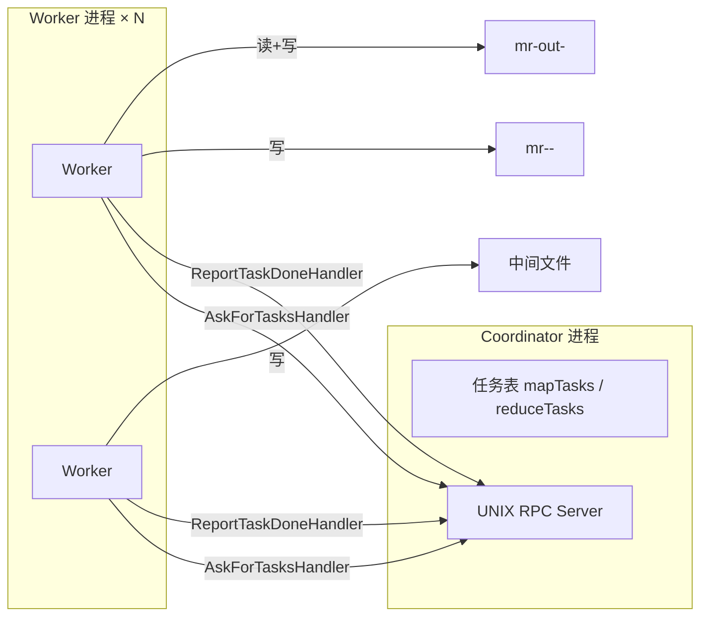

**进程与地址空间：**

- `main/mrcoordinator.go`：创建 `Coordinator`，循环 `Done()` 直到 Map+Reduce 全部完成。
- `main/mrworker.go`：加载 `mrapps/*.so` 插件，执行 `mapf` / `reducef`，通过 **UNIX socket** 与 Coordinator RPC。
- 中间结果在 **Worker 本地文件系统**（当前目录），不是共享内存；这是真实 MapReduce「本地磁盘 + 网络 shuffle」的简化版。

**系统调用视角：** Worker `os.ReadFile` / `os.CreateTemp` / `os.Rename` 对应内核 VFS 层文件描述符；Coordinator 的 `net.Listen("unix", sockname)` 在文件系统上创建 socket 路径，数据在内核 unix sk_buff 间传递，不经过 TCP/IP 栈。

### 1.3 RPC 接口（`src/mr/rpc.go`）

| RPC | 方向 | 作用 |
|-----|------|------|
| `Coordinator.AskForTasksHandler` | Worker → Coordinator | 领取 Map / Reduce / Wait / Exit 任务 |
| `Coordinator.ReportTaskDoneHandler` | Worker → Coordinator | 上报任务完成 |

**任务类型（`AskTaskReply.TaskType`）：**

| 常量 | 含义 |
|------|------|
| `MapTask` | 处理 `FileName` 对应输入文件 |
| `ReduceTask` | 处理分区 `TaskID`（0 … nReduce-1） |
| `WaitTask` | 暂无可用任务（Map 全在进行中），Worker `Sleep` |
| `ExitTask` | 全部完成，Worker 退出 |

**任务状态（Coordinator 内 `TaskMeta`）：**

```
Idle → InProgress → Completed
         ↑_______|
    超时 10s 可重回调度
```

### 1.4 Coordinator 调度逻辑（`coordinator.go`）

核心状态机：

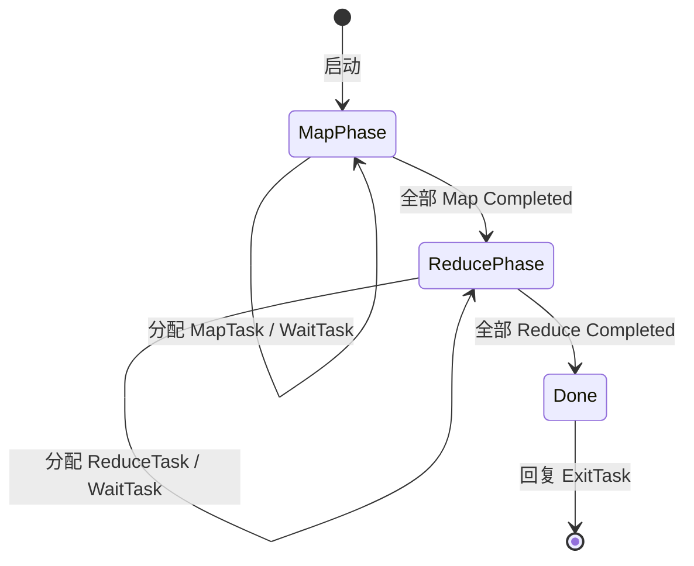

要点：

1. **先 Map 后 Reduce**：`isMapDone == false` 时只分配 Map；全部 Map 完成后才分配 Reduce。
2. **互斥**：`sync.Mutex` 保护任务表与计数器，避免 RPC 并发破坏状态。
3. **Straggler / 崩溃恢复**：`InProgress` 超过 **10 秒** 视为失败，任务可再次被分配（**at-least-once** 执行 Map/Reduce）。
4. **幂等完成**：`ReportTaskDoneHandler` 若任务已是 `Completed`，直接返回，避免重复计数。

### 1.5 Worker 执行流程（`worker.go`）

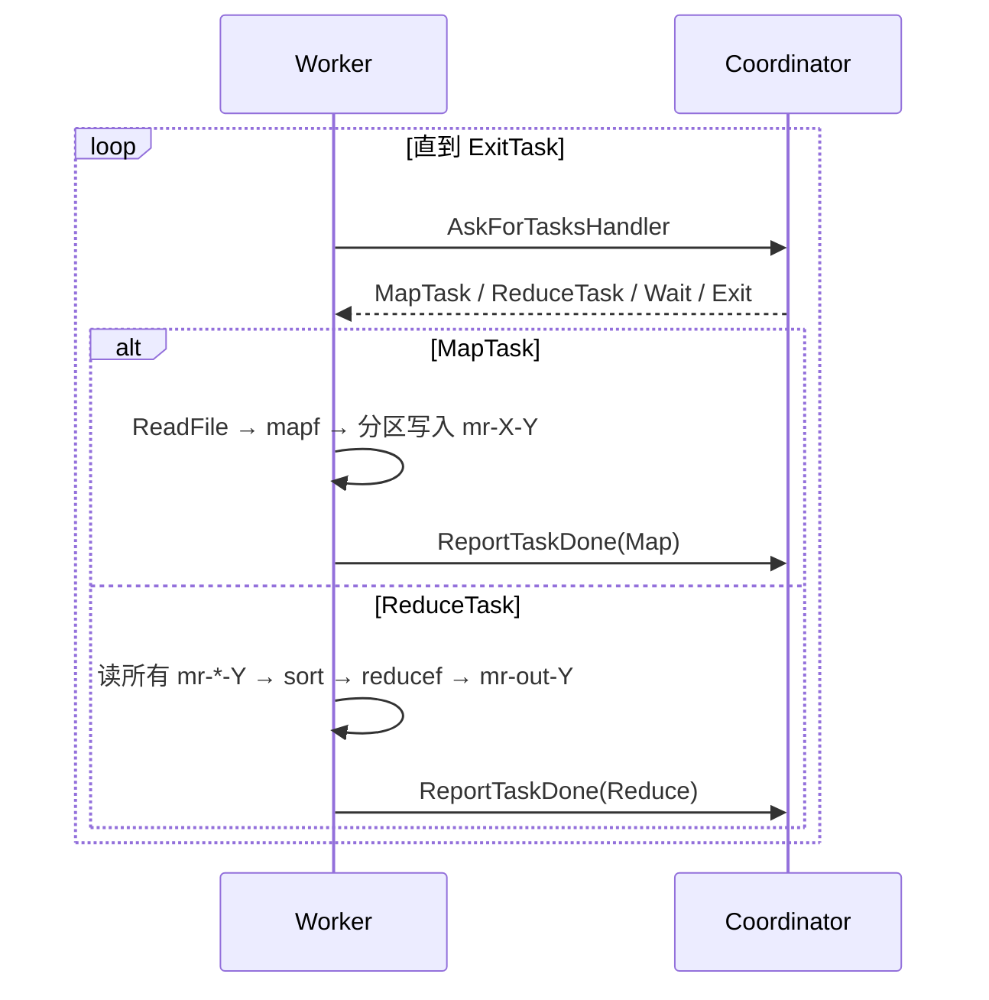

**Map 阶段：**

1. 读入整个输入文件（内存中）。
2. `mapf` 产生 `[]KeyValue`。
3. 对每个 KV：`bucket = ihash(key) % NReduce`（FNV-1a 哈希，保证相同 key 进同一 Reduce 分区）。
4. 每个 bucket 一个 JSON 编码的临时文件，`Rename` 为 `mr-<MapTaskID>-<bucket>`。

**Reduce 阶段：**

1. 打开所有 `mr-<i>-<ReduceTaskID>`（`i` 从 0 到 NMap-1）。
2. JSON 解码合并到 `intermediate`，按 key **排序**。
3. 对相同 key 的 value 分组，调用 `reducef`。
4. 输出 `mr-out-<ReduceTaskID>`（格式：`key value\n`）。

**与论文对应：**

| 论文概念 | 本实现 |
|----------|--------|
| Master 调度 | `Coordinator` + 两个 RPC |
| Map 输出分区 | `ihash(key) % nReduce` + 文件 `mr-i-j` |
| Reduce 输入 | 读齐所有 Map 的第 j 号分区 |
| 容错 | 10s 超时重派 + 完成上报去重 |

### 1.6 关键源文件

| 文件 | 职责 |
|------|------|
| `mr/coordinator.go` | 任务表、调度、RPC handler、`MakeCoordinator` |
| `mr/worker.go` | `Worker` 主循环、`doMapTask`、`doReduceTask` |
| `mr/rpc.go` | RPC 与任务类型常量 |
| `main/mrcoordinator.go` | 启动 Coordinator（**勿改**） |
| `main/mrworker.go` | 启动 Worker（**勿改**） |

---

## Lab 2：单机 KV Server

### 2.1 目标

在 **单台机器、单副本** 上实现 **线性化（linearizable）** 的 KV 服务：

- `Get(key)` → `(value, version, err)`
- `Put(key, value, version)` → **条件写**：仅当 `version` 与 server 当前一致时成功，并递增 version
- Clerk 在 **不可靠网络** 下重试 RPC，并向上层暴露 `ErrMaybe`
- 用 KV + CAS 实现 **分布式锁**（`Acquire` / `Release`）

后续 Lab 会把类似 server **复制到多台机器**（Raft），因此本 Lab 的 version 语义会延续。

### 2.2 分层架构

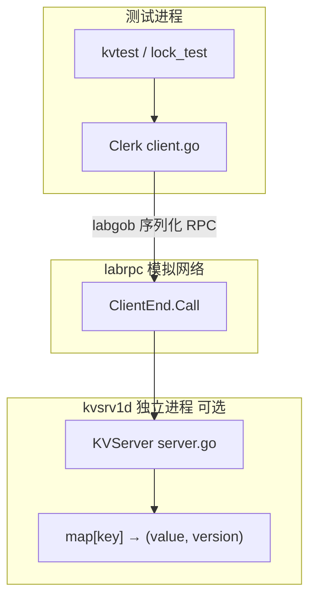

**与 Lab 1 的对比：**

- **状态**：KV 状态在 **Server 堆**上的 Go map；MapReduce 中间状态在 **Worker 磁盘文件**。
- **一致性**：KV 靠 **mutex + 单 server** 保证线性化；MapReduce 靠 **不可变中间文件 + 任务只完成一次计数** 保证正确性（允许 at-least-once 执行，Reduce 需函数满足结合律/去重）。

**进程模型（`tester1` + `main/kvsrv1d.go`）：**

- 测试与 `kvsrv1d` 是 **不同进程**，通过 UNIX socket / forward 注入 `labrpc`。
- RPC 参数经 **labgob** 编解码 → 等价于跨地址空间拷贝，不能传递 Go 指针。

### 2.3 Server 语义（`kvsrv1/server.go`）

每个 key 存 `Tuple{ value, version }`，所有 handler 在 **`mu` 互斥锁** 下执行。

| 操作 | 条件 | 结果 |
|------|------|------|
| `Get(k)` | key 不存在 | `ErrNoKey` |
| `Get(k)` | 存在 | `OK`, value, version |
| `Put(k,v,0)` | key 不存在 | 创建，**version = 1**，`OK` |
| `Put(k,v,0)` | key 已存在 | `ErrVersion`（不能用 0 覆盖已有 key） |
| `Put(k,v,ver)` | key 存在且 `ver == serverVer` | 更新 value，`version++`，`OK` |
| `Put(k,v,ver)` | key 存在且 `ver != serverVer` | `ErrVersion`（未修改） |
| `Put(k,v,ver>0)` | key 不存在 | `ErrNoKey` |

**version 的作用（系统观）：**

- 等价于每条记录上的 **乐观并发控制（OCC）/ 序列号**。
- Client 用「读到的 version」作为下一次 Put 的 **期望版本** → 只有没人插队时 CAS 成功。
- 重复 Put（相同 version）在 server 上 **不会写两次**（第二次 `ErrVersion`）→ 为 **at-most-once 写入** 打基础。

**实现时注意：** `tuple, ok := cache[key]` 得到的是 **结构体拷贝**；更新必须 **写回 map**：

```go
kv.cache[key] = Tuple{value: args.Value, version: tuple.version + 1}
```

### 2.4 Clerk：不可靠网络（`kvsrv1/client.go`）

两层错误：

| 层 | 信号 | 处理 |
|----|------|------|
| 传输层 | `Call() == false` | 请求或回复丢失 → **重发同一 RPC** |
| 应用层 | `reply.Err` | server 已处理，按语义返回 |

**Get：** 幂等，可无限重试直到 `Call == true`。

**Put：** 重传时 **必须带相同 version**（server 用 CAS 防止双写）。

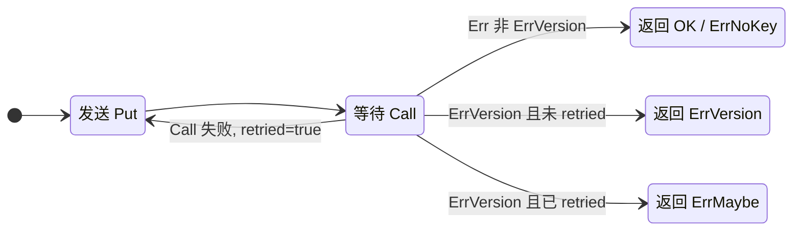

**`ErrMaybe` 含义：** 重传后收到 `ErrVersion`，无法区分：

- （A）第一次 Put 已成功，回复丢失，重传被拒绝；或  
- （B）两次都未执行，别人改动了 version。

上层（如 lock）需 **`Get` 再确认** 或接受测试中的 `OK || ErrMaybe`。

### 2.5 分布式锁（`kvsrv1/lock/lock.go`）

**思路：** 锁名 = KV **key**；value = 持有者 id 或 `""`（空闲）；用 **Get + conditional Put** 实现 CAS 锁。

| 字段 | 含义 |
|------|------|
| `lockname` | KV key（每把锁独立） |
| `id` | `MakeLock` 时 `kvtest.RandValue(8)` 生成，**进程内固定**，表示本 client |

**Acquire 循环：**

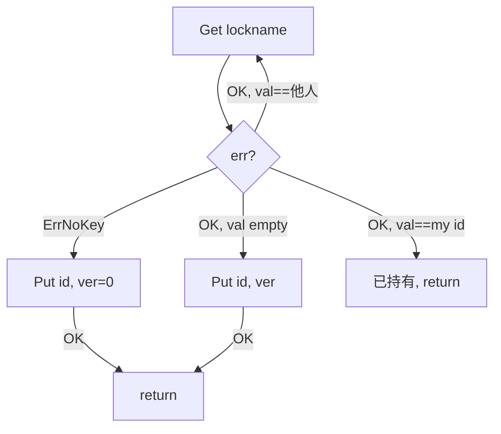

**Release：** `Get` 确认 `val == my id` → `Put("", ver)` 释放。

在 Clerk 已实现重试的前提下，即使 `Put` 只判断 `== OK`，下一轮 `Get` 也常能消化 `ErrMaybe`；显式处理 `ErrMaybe` 更清晰，与 `lock_test.go` 中对 `"l0"` 的写法一致。

### 2.6 测试与验证

| 命令 | 覆盖 |
|------|------|
| `make RUN="-run Reliable" kvsrv1` | 单 client Put/Get、并发 Put、内存 |
| `make RUN="-run Unreliable" kvsrv1` | `TestUnreliableNet`（ErrMaybe） |
| `make lock1` | 锁可靠 + 不可靠、多 client |

线性化由 **Porcupine** 模型检查（`kvtest1`），在并发 Get/Put 场景验证历史可串行化为某一顺序执行。

### 2.7 Lab 2 关键源文件

| 文件 | 职责 |
|------|------|
| `kvsrv1/server.go` | `KVServer`、map、mutex、`Get`/`Put` |
| `kvsrv1/client.go` | `Clerk`、RPC 重试、`ErrMaybe` |
| `kvsrv1/rpc/rpc.go` | 错误码与 Args/Reply 类型 |
| `kvsrv1/lock/lock.go` | `Acquire` / `Release` |
| `kvsrv1/test.go` | 接入 `tester1` |
| `labrpc/labrpc.go` | 模拟网络 |
| `main/kvsrv1d.go` | KV daemon 入口 |

---

## Lab 3：Raft（3A + 3B + 3C + 3D）

实现论文 [*In Search of an Understandable Consensus Algorithm (Extended Version)*](https://raft.github.io/raft.pdf) Figure 2 中的 **Leader 选举**、**日志复制**、**持久化** 与 **日志压缩（Snapshot）**。核心代码在 `src/raft1/raft.go`。

### 3.0 目标与分层

| Part | 目标 | 测试 |
|------|------|------|
| **3A** | 选举唯一 Leader；心跳压制抢选；Leader 失效后重选 | `make RUN="-run 3A" raft1` |
| **3B** | Leader 接收命令、复制 log、多数派提交；各副本经 `applyCh` 上报 | `make RUN="-run 3B" raft1` |
| **3C** | `persist()` / `readPersist()`；崩溃重启后恢复 term、vote、log | `make RUN="-run 3C" raft1` |
| **3D** | Snapshot 压缩 log；`InstallSnapshot` RPC；滞后 follower 追进度 | `make RUN="-run 3D" raft1` |

**与 Lab 2 的关系：** Lab 2 是单副本 KV；Raft 把「复制 + 共识」从应用里拆出来。Lab 4 会用 Raft 复制 Lab 2 风格的 KV，`Start(command)` 相当于 client 写 log，`applyCh` 相当于「已提交命令交给状态机执行」。

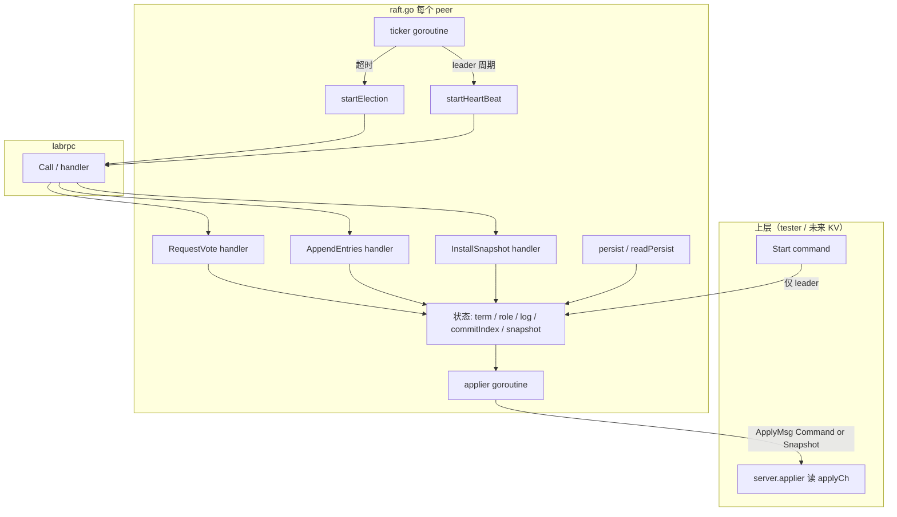

**进程与内存：** 每个 peer 是独立 goroutine 集合，共享状态在 `Raft` 结构体堆上，用 `sync.Mutex` 保护。`labrpc.Call()` 在客户端 goroutine 阻塞，对端在 **另一 goroutine** 执行 handler——与 Lab 2 相同，不能持锁做 RPC（否则 handler 拿不到锁会死锁）。

---

### 3.1 核心状态（`Raft` struct）

对照 Figure 2，本实现字段如下：

| 类别 | 字段 | 含义 |
|------|------|------|
| **持久化**（Figure 2 + 3D） | `currentTerm`, `votedFor`, `log` | 任期、本 term 投给谁、日志 |
| **持久化（3D 新增）** | `lastIncludedIndex`, `lastIncludedTerm`, `snapshot[]` | 快照覆盖的最高 log index/term；快照字节 |
| **易失** | `commitIndex`, `lastApplied`, `currentState` | 已提交 / 已 apply 下标、Follower/Candidate/Leader |
| Leader 专用 | `nextIndex[]`, `matchIndex[]` | 对每个 peer：下一条要发的 index；已确认复制的最大 index |
| 选举计时 | `lastRPC`, `r` | 上次收到合法 RPC 的时间；每 peer 独立随机种子 |
| 心跳节流 | `lastHeartBeat` | Leader 上次批量发 AppendEntries 的时间（≥100ms 间隔） |
| 与上层通信 | `applyCh` | 提交后发送 `ApplyMsg`（Command 或 Snapshot） |

**Log 下标约定（课程建议）：**

- 底层 slice **0-index**，`log[0] = {Term:0}` 或 `{Term: lastIncludedTerm}` 为 **dummy 哨兵**（无业务命令）。
- **逻辑 index**（论文里的 log index）：`GetLastLogIndex() = lastIncludedIndex + len(log) - 1`。
- **物理 index**：`physicalIndex(i) = i - lastIncludedIndex`（`i > lastIncludedIndex` 时）；`i == lastIncludedIndex` 对应 dummy 槽位 0。
- 第一条真实命令在 **index = 1**（无快照时）；有快照后，dummy 代表「快照边界那条 log entry」。
- `nextIndex[i]` 初始为 `GetLastLogIndex() + 1`；`PrevLogIndex = nextIndex - 1`。

```go
type LogEntry struct {
    Term    int64
    Command interface{}  // Raft 不解析内容，Lab 4 才是 Put/Get
}
```

---

### 3.2 后台 Goroutine 分工

| Goroutine | 入口 | 职责 |
|-----------|------|------|
| `ticker()` | `Make()` | 短 sleep 后轮询：非 leader 检查选举超时；leader 节流发心跳 |
| `applier()` | `Make()` | `lastApplied < commitIndex` 时递增并写 `applyCh` |
| `startElection()` | ticker 超时 / candidate 再超时 | term++、拉票、过半变 leader |
| `startHeartBeat()` | ticker / `Start()` / 刚当选 | 并行 AppendEntries（复制或空心跳） |
| RPC handler | labrpc 回调 | `RequestVote` / `AppendEntries` 改本地状态 |

**选举超时模型（不用 `time.Timer`）：**

- **不是**「每次 sleep 300ms 就选举」。
- 而是：`lastRPC` 记录上次收到合法 RPC 的时刻；ticker 里 `time.Since(lastRPC) >= randomTimeout()` 才触发选举。
- 收到 AppendEntries（合法 term）或 Grant RequestVote 时更新 `lastRPC`，相当于重置计时器。

参数：`MinElectionTimeout=150ms`，`MaxElectionTimeout=300ms`（每 peer 随机，减少 split vote）；Leader 心跳间隔 **>100ms**（测试要求 ≤10 次/秒）。

---

### 3.3 Part 3A：选举 + 心跳

#### 3.3.1 状态机（Follower / Candidate / Leader）

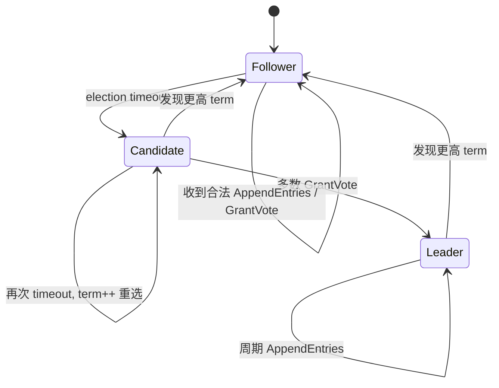

#### 3.3.2 `RequestVote`（Follower 视角 — 被拉票）

决策顺序：

1. `args.Term < currentTerm` → 拒绝  
2. `args.Term > currentTerm` → 升 term、变 Follower、`votedFor = -1`  
3. 本 term 已投他人 → 拒绝  
4. **`isLogUpToDate`**：candidate log 至少一样新 → 否则拒绝（3B 选举限制）  
5. Grant：`votedFor = CandidateId`，`lastRPC = Now`

**Log 新旧比较（5.4.1）：** 先比 `LastLogTerm`，再比 `LastLogIndex`；**相等时也要投**（`>=`，不是 `>`）。

#### 3.3.3 `startElection()`（Candidate 视角 — 发起拉票）

1. 持锁：`candidate`，`term++`，`votedFor = me`，`lastRPC = Now`  
2. 快照 `termAtStart`、`LastLogIndex/Term`，`grantedVotes = 1`（投自己）  
3. **解锁**后对每个 `peer != me` 开 goroutine：`sendRequestVote`  
4. 收到 reply 后持锁：更高 term → Follower；过期 reply 丢弃；`VoteGranted` → 计票  
5. 过半 → `leader`，重置 `nextIndex[i]=len(log)`、`matchIndex[i]=0`，**立即** `startHeartBeat()`

**锁契约：** RPC 不持锁；`startElection` / `startHeartBeat` 为「普通函数」，内部自管 `mu`；`ticker` 调用前先 `Unlock`，返回后再 `Lock`。

#### 3.3.4 `AppendEntries` 空包 = 心跳（3A 阶段）

Follower：合法 term → 变 Follower、更新 `lastRPC`（压制抢选）。  
Leader：`startHeartBeat()` 周期性发送 `Entries=[]` 的 AppendEntries。

---

### 3.4 Part 3B：日志复制 + 提交 + Apply

#### 3.4.1 端到端数据流

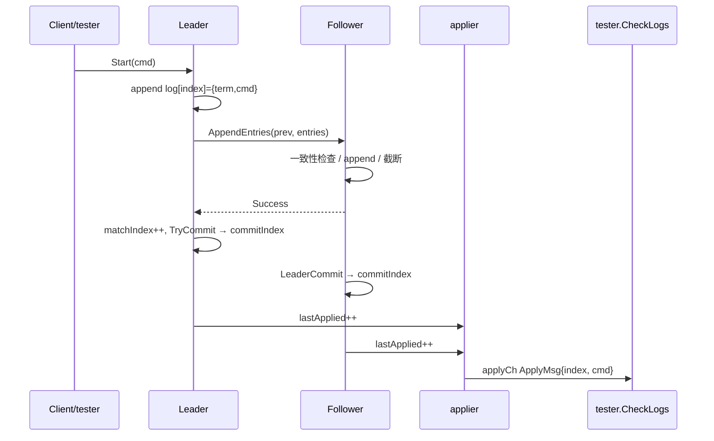

#### 3.4.2 `Start(command)`（Leader 写 log）

- 非 leader → `(-1, term, false)`  
- Leader → `append LogEntry{currentTerm, command}`，返回 `(index, term, true)`  
- `go startHeartBeat()` 立即推动复制（不持锁发 RPC）

#### 3.4.3 `AppendEntries`（Follower 复制）

在 term 检查与 `lastRPC` 更新之后：

1. **PrevLog 匹配**：`log[PrevLogIndex].Term == PrevLogTerm`，否则 `Success=false`  
2. **逐条处理 Entries**（循环末尾必须 `index++`）：  
   - 同 index 不同 term → 截断 `log[index:]` 再 append  
   - 同 index 同 term → 跳过（重复 RPC）  
   - index 超出当前 len → append  
3. **Follower 提交**：`commitIndex = min(LeaderCommit, PrevLogIndex + len(Entries))`（3D 后 `LeaderCommit` 不得超过 follower 已有 log 末尾）

> **3C/3D 易错点：** `LeaderCommit` 不能直接用 `len(log)-1` 当上限，必须用 **`PrevLogIndex + len(Entries)`** 表示「本次 RPC 实际带来的最后一条 index」；否则空心跳会把 commit 推到尚未 append 的位置。

#### 3.4.4 `startHeartBeat()`（Leader 复制）

对每个 follower `p`（快照后并发）：

```
PrevLogIndex = nextIndex[p] - 1
PrevLogTerm  = log[PrevLogIndex].Term
Entries      = log[nextIndex[p]:]
```

- **Success**：`matchIndex[p] = PrevLogIndex + len(Entries)`，`nextIndex[p] = matchIndex[p]+1`，`TryCommit()`  
- **Failure**（同 term）：`nextIndex[p] = max(1, nextIndex[p]-1)` 回退重试  

**并发：** `nextIndex` 用 `make+copy` 做**深拷贝**快照，避免多 goroutine 无锁读共享 slice；reply 处理只写 `rf.nextIndex[p]`。

#### 3.4.5 `TryCommit()`（Leader 提交）

从 log **末尾向前**扫描，仅考虑 **`log[i].Term == currentTerm`** 的 entry；若多数派 `matchIndex >= i`，则 `commitIndex = i` 并 break。

> 不提交旧 term 的 entry，避免未充分复制的历史 log 被 commit（Figure 2 安全性）。

#### 3.4.6 `applier()` 与 `applyCh`

- `commitIndex`：共识层「可以交付」的上界（Leader 本地 commit 或 Follower 跟 LeaderCommit）。  
- `lastApplied`：已交给上层的上界。  
- **3B**：`lastApplied++` → 发 `CommandValid` ApplyMsg。  
- **3D**：先 `lastApplied++`；若 `lastApplied <= lastIncludedIndex` 发 **Snapshot** ApplyMsg，否则发 Command（详见 [§3.9.6](#396-applier-与-snapshot-applymsg3d-核心)）。  
- 拷贝 command/snapshot 后 **Unlock** → `applyCh <-`（禁止持锁阻塞上层）。

`server.go` 中 `applier` / `applierSnap` 读 channel，调用 `tester.CheckLogs` 或 `ingestSnap`；3B 的 `one()` 即等待多数 peer 在同一 index 提交相同 command。

---

### 3.5 锁契约（复习要点）

| 场景 | 规则 |
|------|------|
| 读/写 `term`、`log`、`nextIndex` 等 | 持 `mu` |
| `labrpc.Call()` | **禁止**持锁 |
| `startElection` / `startHeartBeat` | 普通函数，内部 Lock/Unlock；调用方若已持锁需先 Unlock |
| 刚当选 leader 在选举 goroutine 里调 `startHeartBeat` | 先 Unlock 再调，避免重入死锁 |
| `applyCh <-` | Unlock 后再 send |

---

### 3.7 3B 测试一览

| 测试 | 考察点 |
|------|--------|
| `TestBasicAgree3B` | 连续 Start，index 1,2,3…，全员 commit |
| `TestRPCBytes3B` | 按 `nextIndex` 增量发送，勿每次发整段 log |
| `TestFollowerFailure3B` | 少数派仍可 commit；无 quorum 不 commit |
| `TestLeaderFailure3B` | 新 leader 继承已提交 log |
| `TestFailAgree3B` / `TestRejoin3B` | 断连重连、旧 leader 退让 |
| `TestBackup3B` | follower log 冲突时 nextIndex 回退对齐 |
| `TestConcurrentStarts3B` | 并发 Start |

---

### 3.8 Part 3C：持久化（Persistence）

#### 3.8.1 论文动机（Figure 2 + §5.4）

Raft 把状态分为 **持久化（persistent）** 与 **易失（volatile）**：

| 论文 Figure 2 | 是否持久化 | 本实现字段 |
|---------------|------------|------------|
| `currentTerm` | ✅ | `currentTerm` |
| `votedFor` | ✅ | `votedFor` |
| `log[]` | ✅ | `log` |
| `commitIndex` | ❌ 易失 | `commitIndex`（重启后可从 leader 同步） |
| `lastApplied` | ❌ 易失 | `lastApplied` |
| Leader 的 `nextIndex` / `matchIndex` | ❌ 易失 | 重启后重新探测 |

**为什么要持久化？** 节点崩溃后内存全部丢失。若不把 `term`、`votedFor`、`log` 写入稳定存储：

- 可能 **重复投票**（split vote 或破坏「每 term 最多一票」）；
- 可能 **覆盖已复制 log**（Figure 8 场景 c/d）；
- 已答应客户端的 committed entry 可能消失。

**系统观：** `persist()` 把 Go 堆上的 Raft 状态 **序列化** 为字节流，经 `Persister.Save()` 写入测试框架模拟的「磁盘」。崩溃等价于进程地址空间被回收；`Make()` 时 `readPersist()` 从字节流 **反序列化** 恢复堆对象——与真实 DB/WAL 把内存页刷盘同构。

#### 3.8.2 何时调用 `persist()`

论文 Figure 2 规则：**在响应 RPC 之前** 或 **在修改持久化状态之后** 必须落盘。本实现至少在以下时机调用：

| 事件 | 位置 |
|------|------|
| `currentTerm` / `votedFor` 变化 | `RequestVote`、`AppendEntries`（更高 term）、`InstallSnapshot`、`startElection` |
| `log` 追加或截断 | `AppendEntries` follower 处理完 entries **之后**（不是之前） |
| Leader `Start()` 追加本地 log | `Start()` |
| 快照边界更新 | `Snapshot()`、`InstallSnapshot()` |

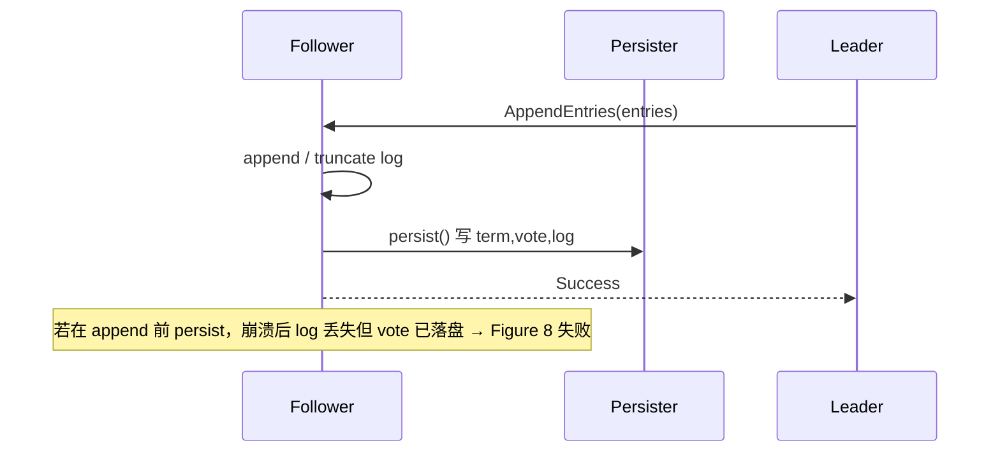

#### 3.8.3 `persist()` / `readPersist()` 实现要点

使用 **labgob** 按固定顺序编码（顺序必须与解码一致）：

```go
// 编码顺序
currentTerm → votedFor → log → lastIncludedIndex → lastIncludedTerm
// 3D 起 Save 第二个参数为 snapshot 字节
persister.Save(raftstate, rf.snapshot)
```

`readPersist()` 在 `Make()` 末尾调用；3D 起还需 `rf.snapshot = persister.ReadSnapshot()`。

**`Persister.Save` 原子性**（`tester1/persister.go`）：一次调用同时更新 `raftstate` 与 `snapshot` 副本，避免「log 元数据与快照内容不一致」——Lab 4 真实 KV 快照也依赖这一性质。

#### 3.8.4 Fast Backup（论文 §7 / 学生指南优化）

3B 逐条回退 `nextIndex--` 在 follower log 很长时 RPC 过多。3C 测试要求 **AppendEntriesReply** 携带冲突信息：

| 字段 | 含义 | Leader 动作 |
|------|------|-------------|
| `XTerm = -1, XLen` | follower log **太短** | `nextIndex = XLen` |
| `XTerm, XIndex` | index 处 **term 冲突** | Case 1：follower 无 `XTerm` → `nextIndex = XIndex` |
| | | Case 2：leader 有 `XTerm` 最后位置 → `nextIndex = lastIndexOfTerm(XTerm)+1` |
| | | Case 3：否则 → `nextIndex = XIndex` |

Follower 在 `AppendEntries` 里计算 `XTerm/XIndex/XLen`；Leader 在 `startHeartBeat` 的 reply 处理分支更新 `nextIndex`（仍须 `max(..., 1)`）。

#### 3.8.5 3C 测试一览

| 测试 | 考察点 |
|------|--------|
| `TestPersist13C` | 单条 log 后 kill/restart，term 与 log 恢复 |
| `TestPersist23C` | 多轮 kill + 断连 + 重连 |
| `TestPersist33C` | 分区 + crash + leader 重启 |
| `TestFigure83C` | 论文 Figure 8 四个场景（依赖持久化正确性） |
| `TestUnreliableAgree3C` / `TestFigure8Unreliable3C` | 不可靠网络 + 持久化 |
| `TestReliableChurn3C` / `TestUnreliableChurn3C` | 反复 kill/restart 随机 peer |

---

### 3.9 Part 3D：快照与日志压缩（Snapshot）

#### 3.9.1 论文动机（§7 Log Compaction）

状态机（如 KV 数据库）执行完大量 command 后，**历史 log 只用于崩溃恢复与滞后副本追赶**。若无限保留：

- Raft 层 `log[]` 与 **持久化字节** 线性增长（3C 的 `PersistBytes()` 测试会失败）；
- 滞后 follower 需要重放整条 log，恢复变慢。

**Snapshot** 把 **某一 committed index 之前的状态机完整状态** 冻结为 blob，并 **丢弃该 index 之前的 log 前缀**。之后：

- 新命令只追加在 snapshot 之后的 **log tail**；
- 复制 lag 很大的 follower 可直接收 **InstallSnapshot RPC**，不必逐条 replay。

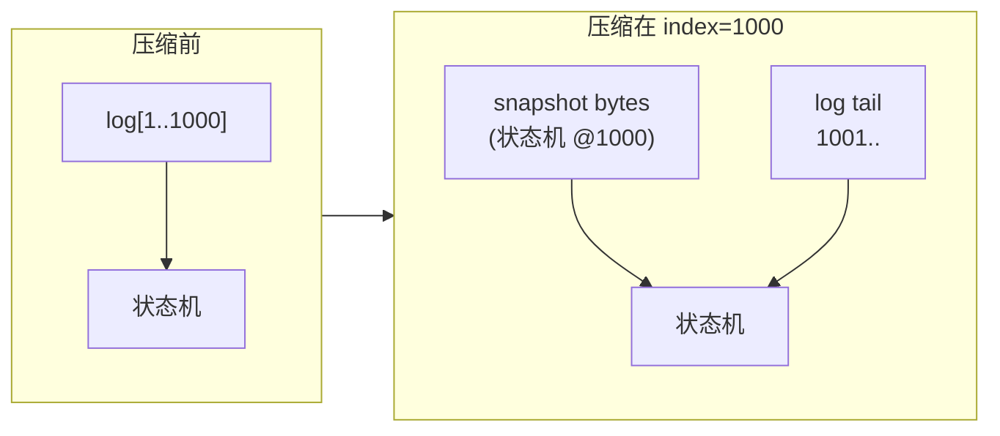

#### 3.9.2 两层 Snapshot 分工

| 层 | 谁创建 snapshot 内容 | 谁裁 Raft log |
|----|----------------------|---------------|
| **上层服务**（`server.go`） | 每 `SnapShotInterval=10` 条 command，编码 `{lastIncludedIndex, xlog[]}` | 调用 `rf.Snapshot(index, bytes)` |
| **Raft 层**（`raft.go`） | 存储 bytes；不解析 command 语义 | 更新 `lastIncludedIndex/Term`，`log` 裁为 dummy + tail |

**InstallSnapshot**（leader → lagging follower）：leader 把 **自己已有的 snapshot bytes** 发给 follower，follower 同样裁 log 并 persist。

#### 3.9.3 逻辑 index 与物理 slice（内存布局）

裁掉前缀后，`rf.log` 在内存里只是一段 **连续 slice**（堆上 array），不再从 index 0 对应 log index 0：

```
逻辑 index:  ...  998   999  1000 | 1001  1002  1003
                              ↑ lastIncludedIndex
物理 log[]:  [ dummy @0 ] [ entry @1 ] [ entry @2 ] ...
             Term=lastIncludedTerm
```

| 函数 | 作用 |
|------|------|
| `GetLastLogIndex()` | `lastIncludedIndex + len(log) - 1` |
| `physicalIndex(i)` | 逻辑 `i` → slice 下标；`i < lastIncludedIndex` 返回 -1 |
| `logAt(i)` / `logTerm(i)` | 读 logical index；`i == lastIncludedIndex` 用 `lastIncludedTerm` |

这与论文 §7 一致：**snapshot 替换了 `[0..lastIncludedIndex]` 的 log 前缀**，但 **仍保留 `(lastIncludedIndex, lastIncludedTerm)` 作为 AppendEntries 一致性检查的锚点**（dummy entry）。

#### 3.9.4 `Snapshot(index, snapshot)`（上层回调）

服务层在 apply 完 index 后调用（见 `server.go` `applierSnap`）：

1. 忽略 `index <= lastIncludedIndex` 或 `index > GetLastLogIndex()` 的重复/无效调用；
2. 保存 `snapshot` 副本，`lastIncludedIndex/Term = index / logTerm(index)`；
3. `log = [{Term: lastIncludedTerm}] ++ log[pIndex+1:]`；
4. 若 `commitIndex` 或 `lastApplied` 落后 snapshot 边界，**推进到 index**（该 index 之前状态已在 snapshot 里）；
5. `persist()`。

#### 3.9.5 `InstallSnapshot` RPC（Figure 13 / §7）

**Leader 发送条件**（`startHeartBeat`）：`nextIndex[p] <= lastIncludedIndex` — follower 需要的下一条已在 snapshot 内，无法再用 AppendEntries 从 log 提供。

**Follower 处理**（`InstallSnapshot` handler）：

1. `args.Term < currentTerm` → 拒绝；
2. `args.Term > currentTerm` → 升 term、变 follower、清 `votedFor`、`persist`；
3. `args.LastIncludedIndex <= rf.lastIncludedIndex` → 忽略重复/过时快照；
4. 保存 snapshot、`lastIncludedIndex/Term`，`log = [{Term: lastIncludedTerm}]`；
5. `commitIndex = max(commitIndex, lastIncludedIndex)`；
6. **`persist()`**；**不**在 handler 里直接 `applyCh <-`（交给 applier）；
7. **不**在这里改 `lastApplied`（避免与 applier 重复/乱序）。

**AppendEntries 与 snapshot 交界：**

```go
if args.PrevLogIndex < rf.lastIncludedIndex {
    // follower 告诉 leader：你要的 prev 在快照里，请发 InstallSnapshot
    reply.XLen = rf.lastIncludedIndex
    return
}
```

#### 3.9.6 `applier()` 与 Snapshot ApplyMsg（3D 核心）

3B 只发 `CommandValid`；3D 还需在 **index ≤ lastIncludedIndex** 时发 **Snapshot**，让上层 `ingestSnap` 恢复状态。

**推荐逻辑（先递增再分支）：**

```go
if lastApplied < commitIndex {
    lastApplied++
    if lastApplied <= lastIncludedIndex {
        // 该 index 已在 snapshot 中 → 发 Snapshot ApplyMsg
        applyCh <- ApplyMsg{SnapshotValid: true, SnapshotIndex: lastIncludedIndex, ...}
    } else {
        // 该 index 在 log tail 中 → 发 Command
        applyCh <- ApplyMsg{CommandValid: true, CommandIndex: lastApplied, ...}
    }
}
```

**为何不能对 `index <= lastIncludedIndex` 发 Command？** 裁 log 后 `logAt(i)` 可能为空或 dummy；且服务层 `applierSnap` 要求 **严格递增的 CommandIndex**。若服务层已通过 Snapshot 跳到 330，再收 Command 330 → `expected 331, got 330`。

**重启对齐**（`Make()` + `server.go`）：

```go
// raft.go Make()
rf.readPersist(...)
rf.lastApplied = rf.lastIncludedIndex   // 勿再 apply 已进 snapshot 的 command

// server.go newRfsrv — 进程启动时
ingestSnap(persister.ReadSnapshot(), -1)  // 服务层 lastApplied 对齐
go applierSnap(applyCh)
```

**注意：** `commitIndex` / `lastApplied` 不持久化；重启后 `lastApplied` 必须手动设为 `lastIncludedIndex`，否则 applier 会从 0 重放已在 snapshot 里的 command。

#### 3.9.7 端到端数据流（含 Snapshot）

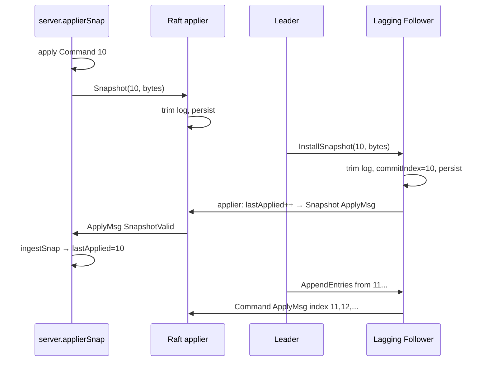

#### 3.9.8 3D 测试一览

| 测试 | 场景 |
|------|------|
| `TestSnapshotBasic3D` | 可靠网；定期 Snapshot；`PersistBytes` 有界 |
| `TestSnapshotInstall3D` | 断连 follower；重连后 InstallSnapshot 追赶 |
| `TestSnapshotInstallUnreliable3D` | 断连 + 不可靠 RPC |
| `TestSnapshotInstallCrash3D` | kill follower + 可靠网 |
| `TestSnapshotInstallUnCrash3D` | kill + 不可靠网 |
| `TestSnapshotAllCrash3D` | 全员 crash/restart + snapshot 恢复 |
| `TestSnapshotInit3D` | 重启后 `ingestSnap` 初始化状态 |

---

### 3.10 关键源文件（3A–3D）

| 文件 | 职责 |
|------|------|
| `raft1/raft.go` | 全部 Raft 逻辑（选举、复制、持久化、快照、applier） |
| `raft1/server.go` | `applierSnap`、`ingestSnap`、周期性 `Snapshot()` 调用 |
| `raftapi/raftapi.go` | `Raft` 接口、`ApplyMsg`（Command / Snapshot 二选一） |
| `tester1/persister.go` | `Save(raftstate, snapshot)` 原子持久化 |
| `labrpc/labrpc.go` | 模拟丢包/延迟的 RPC |
| `raft1/raft_test.go` | 3A–3D 测试用例 |
| `main/raft1d.go` | Raft daemon 入口 |

---

## 概念对照表

| 概念 | MapReduce (Lab 1) | KV (Lab 2) | Raft (Lab 3) |
|------|-------------------|------------|--------------|
| 协调者 | Coordinator | 无（单 server） | **Leader**（动态选举） |
| 任务单元 | Map/Reduce Task | RPC：Get/Put | **log entry**（`Start` 提议） |
| 分区 | `ihash(key) % nReduce` | 每 key 一条记录 | 全复制（每 peer 一份 log） |
| 容错 | 超时重派任务 | RPC 重试 + version CAS | 选举 + log 复制 + commit + **持久化/快照** |
| 执行语义 | at-least-once（Reduce 需幂等） | Put at-most-once；`ErrMaybe` | **committed** 后 apply，顺序一致 |
| 状态裁剪 | 中间文件可删 | 无 | **Snapshot** 丢弃 log 前缀 |
| 互斥 | 任务状态机 | `sync.Mutex` + 条件 Put | **`mu` + 多数派 commit** |
| 与上层接口 | — | Clerk Get/Put | `Start` / `applyCh`（Command + Snapshot） |

---

## 常见坑与调试

### MapReduce

1. **Reduce 过早开始**：必须等 **所有** Map `Completed` 再进入 Reduce 阶段。
2. **中间文件名**：Map 输出 `mr-<mapId>-<reduceBucket>`；Reduce 读 `mr-<i>-<reduceId>`。
3. **重复 Report**：Worker 重试可能导致多次 `ReportTaskDone`，Coordinator 需忽略已完成任务。
4. **插件路径**：在 `src/` 下 `make mr` 构建 `mrapps/*.so`。

### KV Server

1. **新建 key 后 version 应为 1**，不是 0。
2. **map 值类型拷贝**：修改 `tuple` 局部变量不会更新 map。
3. **`Get` 也要加锁**，否则 `-race` 报错且破坏线性化。
4. **Clerk `Get` 在不可靠网下必须循环 `Call`**，不能只调一次。

### Lock

1. **`lk.id` 在 `MakeLock` 生成一次**，不要每次 `Put` 再 `RandValue`。
2. **`Get` 第一个返回值是 value（持有者）**，不是 lockname。
3. 跑锁测试用 `cd src && make lock1`。

### Raft（Lab 3）

1. **选举超时用 `lastRPC + Since`，不是 Timer**：ticker 只负责短间隔检查；Grant 票 / 收到 AppendEntries 要更新 `lastRPC`。
2. **`RequestVote` 的 log 比较用 `>=`**：同等 log 必须互投，否则选不出 leader。
3. **`votedFor` 初始 `-1`**；新 term 要清空；同 term 只允许投一人或重试同一 candidate。
4. **RPC 禁止持锁**；`startElection`/`startHeartBeat` 在 Call 前 Unlock。
5. **`AppendEntries` 循环每条 entry 后 `index++`**，否则多条 log 写同一位置。
6. **`nextIndex` 初始为 1**（dummy 在 0）；回退 `max(1, nextIndex-1)`，避免 `PrevLogIndex=-1` panic。
7. **`TryCommit` 只提交 `log[i].Term == currentTerm`** 的 entry。
8. **`copy(dst, src)` 方向**：快照 nextIndex 用 `copy(nextIndex, rf.nextIndex)`，写反会把 nextIndex 清零。
9. **`applyCh` + `applier`**：`commitIndex` 前进后必须按序 `ApplyMsg`，否则 3B tester 看不到提交。
10. **深拷贝 nextIndex** 再并发读；reply 里只写 `rf.nextIndex[p]`，避免 `-race`。

### Raft 3C（持久化）

11. **`persist()` 在 log append 之后**：Follower `AppendEntries` 若先 persist 再 append，崩溃后 log 丢条但 vote 已落盘 → Figure 8 失败。
12. **所有改 `currentTerm` / `votedFor` / `log` 的路径都要 persist**：含 `Start()`、`RequestVote` Grant、`InstallSnapshot` 升 term。
13. **`LeaderCommit` 上限**：Follower 用 `min(LeaderCommit, PrevLogIndex + len(Entries))`，勿用 `len(log)-1`。
14. **Fast Backup**：冲突 reply 填 `XTerm/XIndex/XLen`；Leader 三种 case 更新 `nextIndex`，避免逐条 `--` 超时。

### Raft 3D（快照）

15. **逻辑 index ≠ slice 下标**：裁 log 后用 `lastIncludedIndex + physicalIndex`；`PrevLogIndex < lastIncludedIndex` 应拒绝并引导 InstallSnapshot。
16. **`applier` 边界**：`lastApplied++` 后若 `lastApplied <= lastIncludedIndex` 发 **Snapshot ApplyMsg**，否则发 Command；勿对 snapshot 内 index 发 Command。
17. **`Make()` 重启**：`readPersist` 后设 `lastApplied = lastIncludedIndex`；`server.go` 启动时 `ingestSnap` 对齐服务层。
18. **`InstallSnapshot` 不直接 apply**：只更新 Raft 状态 + persist；由 applier 发 Snapshot 到 `applyCh`。
19. **`Snapshot()` 与 `persist`**：裁 log、`lastIncludedIndex/Term`、snapshot bytes 同一临界区一次 `Save`。
20. **发送 ApplyMsg 前注意 unlock 窗口**：unlock 与 `applyCh <-` 之间若 `InstallSnapshot` 插入，可能本应发 Snapshot 却发 Command → `expected N+1, got N`；发送前可重检 `index > lastIncludedIndex`。
21. **`nextIndex <= lastIncludedIndex`** 时 leader 发 InstallSnapshot，成功后 `nextIndex = lastIncludedIndex + 1`。

---

## 后续 Lab 预告

| Lab | 目录 | 状态 / 关系 |
|-----|------|-------------|
| Lab 3A–3D | `raft1/` | **已完成**：选举、复制、持久化、Snapshot |
| Lab 4 | `kvraft1/` | 用 Raft 复制 **Lab 2 风格 KV**（`Start` + `applyCh` 驱动状态机） |
| Lab 5 | `shardkv1/` | 分片 + 迁移 |

复习 Lab 2 时建议牢记：**version CAS** 与 **Clerk 重试语义** 会延续到 KV Raft；复习 Lab 3 时牢记 **`commitIndex` / `lastApplied` 分离**、**持久化时机**、**Snapshot 与 log tail 双轨 index**，这是 Lab 4 的基础。

---

## 参考

- 课程主页：<https://pdos.csail.mit.edu/6.5840/>
- MapReduce 论文：[Google Research](https://research.google/pubs/mapreduce-simplified-data-processing-on-large-clusters/)
- Raft 论文：[In Search of an Understandable Consensus Algorithm](https://raft.github.io/raft.pdf)
- 本仓库基于课程公开 skeleton，实现与注释为个人学习记录。

---

*文档随 Lab 进度更新；当前覆盖至 Lab 2（含 lock + unreliable Clerk）与 Lab 3 Raft 3A–3D（选举、复制、持久化、快照）。*
